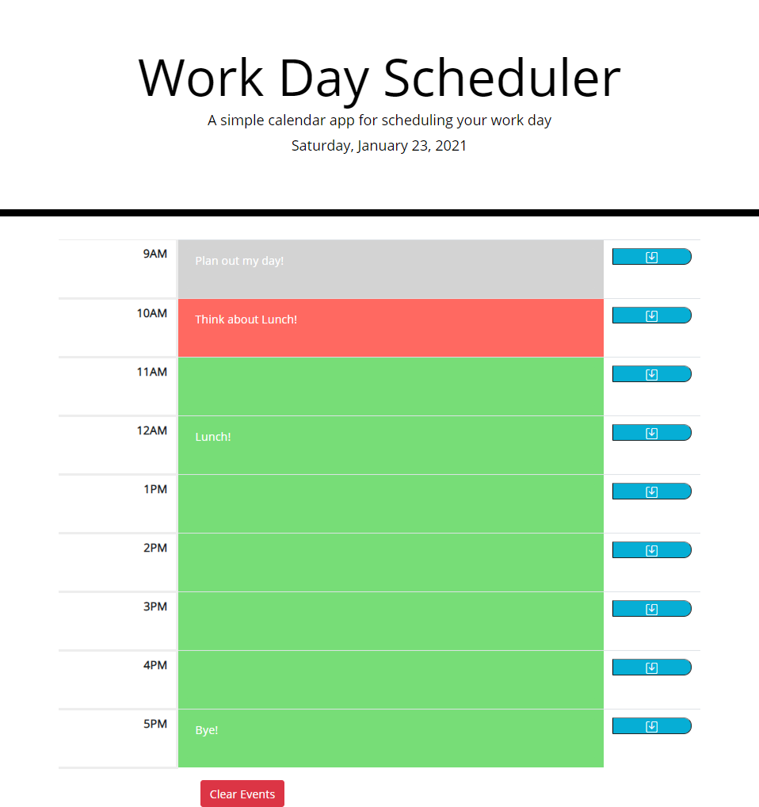

# Work_Day_Schedule_NP

## Desciption

This is a simple work day scheduler that has basic 9-5 hours for you plan out your work day. It will save what typed for the events even after you refresh. This was for a homework assignment to practice some Jquery.

## Screenshot

## Links

https://nickpodski.github.io/Work_Day_Schedule_NP/ - Live URL
https://github.com/Nickpodski/Work_Day_Schedule_NP - Git Hub Repo

## Credits

https://www.w3schools.com/ - W3 Schools
https://stackoverflow.com/ - Stack Overflow